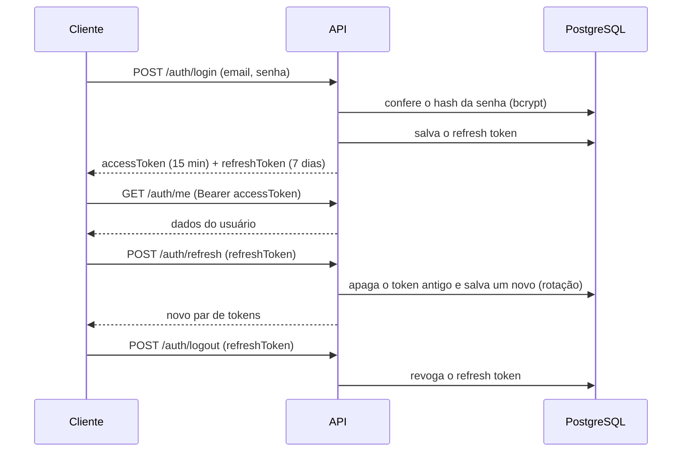

# Auth API: autenticação com JWT e refresh token

[](https://github.com/JorgeBublitz/ApiLogin-Node.Js/actions/workflows/ci.yml)


[](LICENSE)

API de autenticação pronta para servir de base a outros projetos: cadastro, login, sessão com access token de curta duração e refresh token com **rotação** e **revogação**.

## Como funciona a sessão



## Destaques técnicos

- **Rotação de refresh token**: cada renovação invalida o token anterior. Um token roubado deixa de funcionar assim que o usuário legítimo renova a sessão.
- **Refresh tokens guardados no banco**, o que permite revogar sessões no logout.
- **Tokens com `jti` único**, então dois logins no mesmo segundo nunca geram tokens iguais.
- **Validação com Zod** e e-mails normalizados para minúsculas.
- **Segurança**: bcrypt, Helmet, CORS configurável, rate limiting e a mesma mensagem de erro para e-mail inexistente e senha errada.
- **TypeScript em modo `strict`**, documentação Swagger e **testes de integração** (Vitest + Supertest) rodando no **GitHub Actions**.

## Endpoints

Base: `/api`

| Método | Rota | Autenticação | Descrição |
| --- | --- | --- | --- |
| `POST` | `/auth/register` | não | Cria a conta e já devolve os tokens |
| `POST` | `/auth/login` | não | Devolve access token e refresh token |
| `POST` | `/auth/refresh` | refresh token | Rotaciona o refresh token e gera um novo par |
| `POST` | `/auth/logout` | refresh token | Revoga o refresh token |
| `GET` | `/auth/me` | Bearer | Dados do usuário autenticado |
| `GET` | `/health` | não | Status da API |

A documentação interativa fica em `http://localhost:3000/api-docs`.

```bash
curl -X POST http://localhost:3000/api/auth/register \
  -H "Content-Type: application/json" \
  -d '{"name": "Jorge", "email": "jorge@email.com", "password": "senha1234"}'
```

## Stack

Node.js · TypeScript · Express 5 · Prisma · PostgreSQL · JWT · bcryptjs · Zod · Helmet · Swagger · Vitest · GitHub Actions

## Como rodar localmente

**Pré-requisitos:** Node.js 20 ou superior e um PostgreSQL acessível.

```bash
git clone https://github.com/JorgeBublitz/ApiLogin-Node.Js.git
cd ApiLogin-Node.Js
npm install
cp .env.example .env         # preencha DATABASE_URL e os segredos JWT
npx prisma migrate deploy    # cria as tabelas
npm run dev                  # http://localhost:3000/api
```

| Variável | Descrição |
| --- | --- |
| `DATABASE_URL` | Conexão com o PostgreSQL |
| `JWT_ACCESS_SECRET` / `JWT_REFRESH_SECRET` | Segredos de assinatura (use valores longos e diferentes) |
| `JWT_ACCESS_EXPIRATION` / `JWT_REFRESH_EXPIRATION` | Validade dos tokens (padrão `15m` e `7d`) |
| `CORS_ORIGIN` | Origens permitidas em produção, separadas por vírgula |
| `PORT` / `NODE_ENV` | Porta e ambiente |

## Scripts

| Comando | O que faz |
| --- | --- |
| `npm run dev` | Servidor com recarga automática |
| `npm test` | Testes de integração (limpa o banco do `DATABASE_URL`; use um banco só para testes) |
| `npm run lint` / `npm run typecheck` | ESLint e checagem de tipos |
| `npm run build` / `npm start` | Build de produção e execução |

## Licença

MIT
